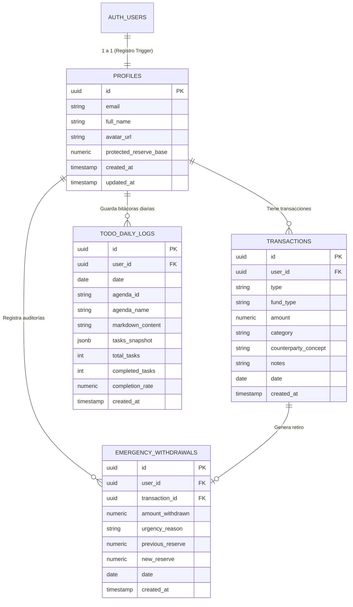

# 🗄️ Modelo de Datos y Diccionario de Entidades

Documentación técnica detallada del modelo relacional implementado en Supabase para el Portal Multipropósito (AppToDo & Finanzas).

---

## 📊 Diagrama Entidad-Relación (ERD)

---

## 📋 Diccionario de Datos

### 1. `profiles`
Contiene la configuración de perfil de cada usuario y la base de reserva financiera asignada.
* **`id` (UUID, PK):** Identificador unívoco del usuario vinculado a `auth.users.id`.
* **`email` (TEXT):** Correo electrónico del usuario.
* **`full_name` (TEXT):** Nombre completo o alias visible.
* **`protected_reserve_base` (NUMERIC):** Monto base intocable (por defecto `$950.00`).

### 2. `transactions`
Registra cada movimiento de flujo de caja (ingreso o egreso) diferenciando el tipo de fondo.
* **`type` (TEXT):** `'income'` (Ingreso) o `'expense'` (Egreso).
* **`fund_type` (TEXT):** `'physical'` (Efectivo/Caja) o `'digital'` (Bancos/Billeteras).
* **`amount` (NUMERIC):** Importe monetario positivo.
* **`category` (TEXT):** Categoría (ej. *Alimentación, Honorarios, Transporte, Servicios, Tesis*).
* **`counterparty_concept` (TEXT):**
  * Para Ingresos: *De qué o de quién provino el dinero* (ej. "Cliente Juan Pérez", "Salario").
  * Para Egresos: *Para qué o a quién se pagó* (ej. "Supermercado Metro", "Impresión empaste").

### 3. `emergency_withdrawals`
Registro inmutable de auditoría para retiros que vulneran el fondo protegido de \$950.
* **`amount_withdrawn` (NUMERIC):** Monto retirado que afectó la reserva.
* **`urgency_reason` (TEXT):** Motivo/Excusa justificada y obligatoria ingresada por el usuario.
* **`previous_reserve` (NUMERIC):** Monto de reserva previa antes del retiro.
* **`new_reserve` (NUMERIC):** Nuevo remanente de reserva tras el retiro.

### 4. `todo_daily_logs`
Almacena el historial diario en formato Markdown para sincronización con Obsidian y persistencia en la nube.
* **`date` (DATE):** Fecha correspondiente a la bitácora.
* **`agenda_id` (TEXT):** Identificador de agenda (`TESIS`, `TRABAJO CC`, etc.).
* **`markdown_content` (TEXT):** Cadena completa en Markdown con listas `- [ ]` y `- [x]`.
* **`tasks_snapshot` (JSONB):** Array estructurado de objetos de tareas.
* **`completion_rate` (NUMERIC):** Porcentaje de cumplimiento del día (0-100%).