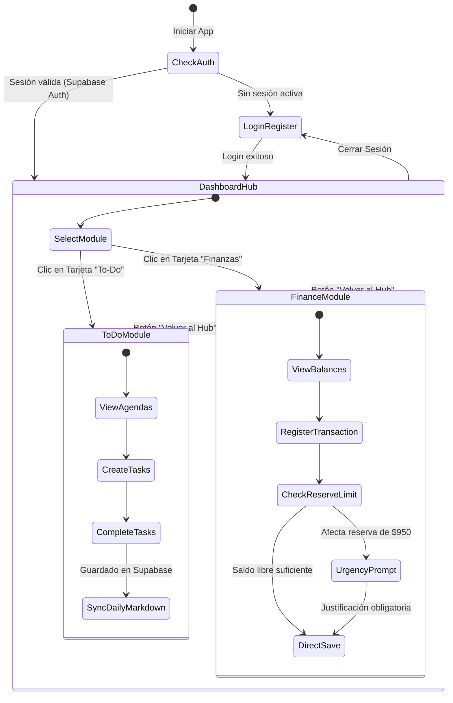

# 🏛️ Arquitectura del Portal Multipropósito

Descripción de la arquitectura frontend/backend, control de sesión con Supabase Auth y enrutamiento modular.

---

## 🔄 Flujo de Navegación y Sesión

---

## 🧩 Componentes del Portal

1. **`AuthView.tsx`:** Formulario unificado de Login y Registro con validación, feedback de errores y soporte para persistencia de sesión en Supabase.
2. **`DashboardHub.tsx`:** Centro de control visual que permite al usuario escoger a qué área de trabajo ingresar (Módulo To-Do o Módulo Financiero).
3. **`FinanceDashboard.tsx`:** Panel completo de métricas financieras, balance de fondos físicos/digitales y gestión de reservas.
4. **`ToDoModule` (AppToDo Integrado):** Gestor de quehaceres diarios con agendas, estados por colores y guardado automático de bitácoras en Markdown.
5. **`AuthContext.tsx`:** Proveedor de contexto global de React que gestiona el estado de autenticación, perfil del usuario y llamadas a la API de Supabase.