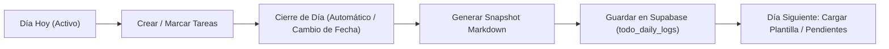

# 📝 Flujo del Módulo To-Do y Sincronización Diaria en Markdown

Documentación del ciclo de vida diario de tareas, transición de fechas y almacenamiento de bitácoras Markdown en Supabase.

---

## 🔄 Ciclo de Vida del To-Do Diario



---

## 📄 Formato del Snapshot Markdown Generado

Al finalizar el día o al exportar, el sistema genera automáticamente un documento con la siguiente estructura:

```markdown
# 📅 [NOMBRE DE AGENDA] — DD/MM/YYYY

> **Métricas:** [X] completadas de [Y] tareas ([Z]%)
> **Fecha de archivo:** YYYY-MM-DD HH:mm:ss

### 📝 Tareas Pendientes
- [ ] 🔴 Redactar metodología y marco teórico
- [ ] 🟡 Descargar artículos científicos

### ✅ Tareas Hechas
- [x] 🟢 Revisar formato APA
- [x] 🔴 Enviar primer borrador a asesor
```

Este snapshot se inserta en `todo_daily_logs` y está disponible tanto en la base de datos como para ser copiado en Obsidian.